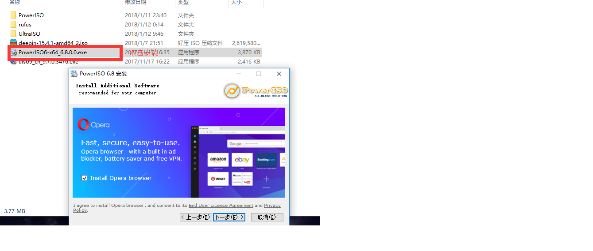

# PowerISO制作启动盘

先说点关于PowerISO的东西吧。[官网](http://www.poweriso.com/)里也有相关的介绍。这是一个收费软件，但你直接试用就行。

1. PowerISO还是比较强大的，功能比较多，一个软件可用当好几个软件使用。
1. PowerISO 是一款强大的 CD/DVD映像文件处理工具。它可以建立，编辑，解压，转换，压缩，加密和分割 ISO/BIN映像文件。
1. 内建虚拟光驱可以加载映像文件实时运行。最重要的是，压缩的文件可以在不解压的情况下直接使用。

在制作过程U盘会被格式化，提前备份数据。

## 制作过程图文教程

- 找到下载好的PowerISO双击安装，安装包可能绑定了别的软件安装的时候取消勾选就行

  

- PowerISO 是一个收费的软件，在这里选择继续试用就行

  

- 然后就可以开始制作了

  

- 选择你的镜像文件，以及目标U盘。U盘将会被格式化，所以一定不要选错了位置。

  

- 点击开始后就是等待了。
- 制作完成后将U盘插好，重启电脑进入BIOS界面，设置U盘为第一启动项，然后就可以进行Linux的安装了。

### ***相关链接:***

[PowerISO官网](http://www.poweriso.com/)||[文件系统](../Disk-knowledge/FileSystem.md)||[簇大小](../Disk-knowledge/ClusterSize.md)||[FreeDOS、ISO镜像、DD镜像的区别](../Disk-knowledge/DOS-ISO-DD.md)