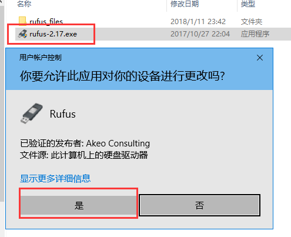
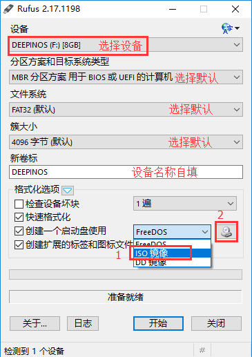
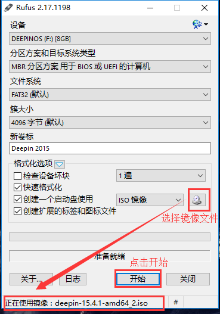
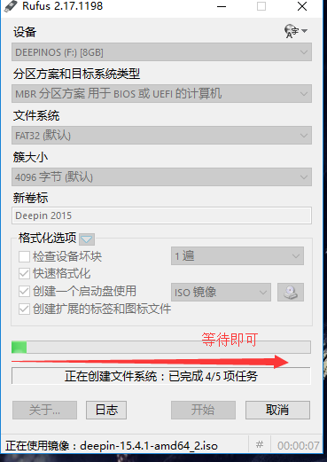
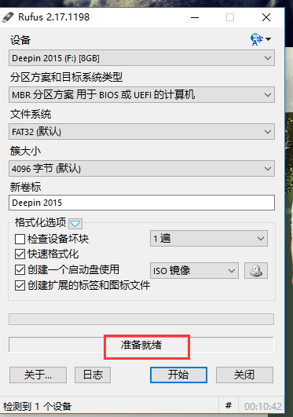

# Rufus制作启动盘

个人比较推荐使用Rufus制作工具，随便介绍几点，别嫌我话多。[Rufus官网](http://rufus.akeo.ie)

1. Rufus 完全免费开源，支持中文。
1. Rufus 体积小只有几M大小。不需要安装直接点开即用，非常方便，成功率也比较高。
1. Rufus的一大特点是速度快。Rufus 官方宣称在制作启动盘时Rufus的速度大约能达到同等软件的2倍
1. Rufus 支持 UEFI 以及 GPT 格式的安装，你完全可以在 EFI 模式安装 Windows 10、Windows 8/7或者Linux。

在制作过程U盘会被格式化，提前备份数据。

## 制作过程图文教程

- 找到下载好的Rufus双击运行

  

- 选择要制作的U盘，以及镜像文件。如图：在选择设备的时候一定要选择正确的U盘，否则数据会被格式化，一不小心就是坑。然后选择IOS镜像格式。关于[文件系统](/knowledge-base/base/Disk-knowledge/FileSystem.md)，[簇大小](/knowledge-base/base/Disk-knowledge/ClusterSize.md)以及FreeDOS、ISO镜像、DD镜像的相关知识，有兴趣的可以瞄一下最下方相关链接里的内容。

  

- 选择镜像文件，这里我使用的是deepin镜像，此处你选择自己需要安装的Linux版本即可。

  

- 等待写入完成即可

  

- 制作完成点击关闭即可

  

- 制作完成后将U盘插好，重启电脑进入BIOS界面，设置U盘为第一启动项，然后就可以进行Linux的安装了。

### ***相关链接:***

[Rufus官网](http://rufus.akeo.ie)||[文件系统](../Disk-knowledge/FileSystem.md)||[簇大小](../Disk-knowledge/ClusterSize.md)||[FreeDOS、ISO镜像、DD镜像的区别](../Disk-knowledge/DOS-ISO-DD.md)