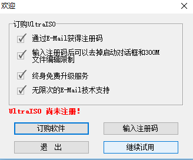
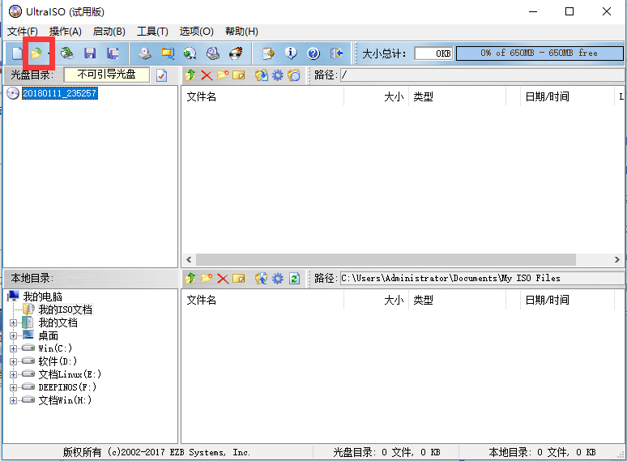
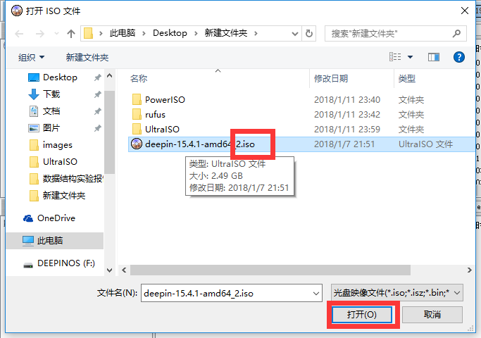
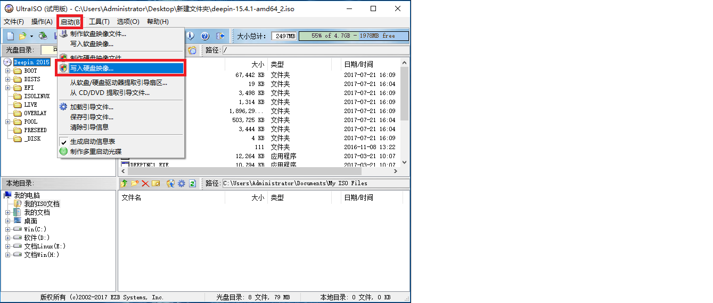
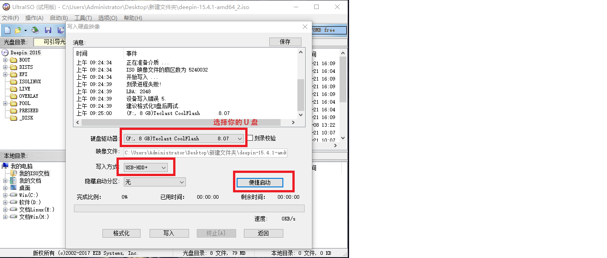
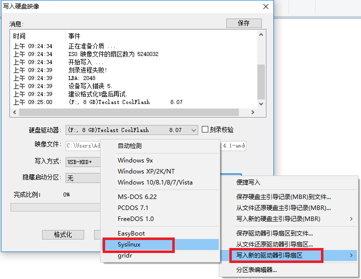
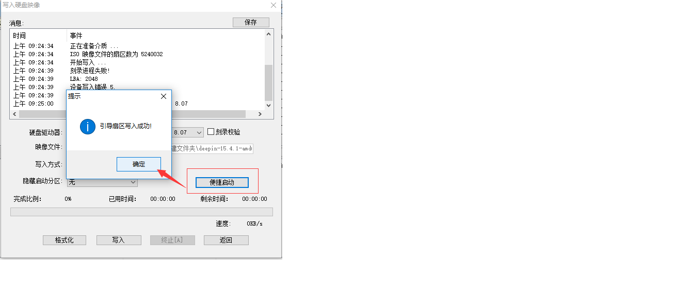
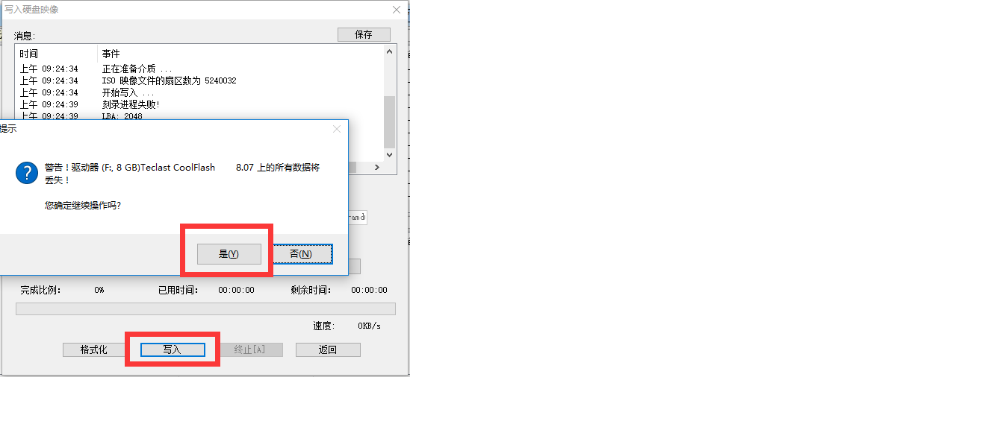
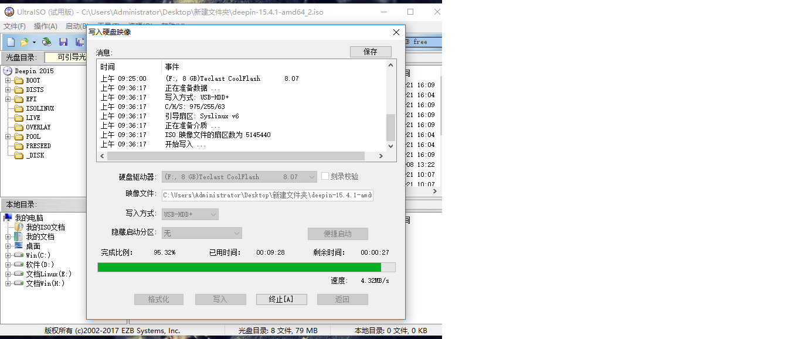

# UltraISO制作启动盘

UltraISO是个收费软件，[UltraISO官网](https://cn.ultraiso.net/)里也有相关介绍。在这里就随便说几句。

1. UltraISO（软碟通） 用于光盘映像文件的制作/编辑/转换工具，功能比较强大。
1. UltraISO 可以直接编辑ISO文件和从ISO中提取文件和目录，也可以从CD-ROM制作光盘映像或者将硬盘上的文件制作成ISO文件。
1. 使用UltraISO，你可以随心所欲地制作/编辑/转换光盘映像文件，配合光盘刻录软件烧录出自己所需要的光碟。

在制作过程U盘会被格式化，提前备份数据。

## 制作过程图文教程

- 找到下载好的UltraISO双击安装， UltraISO是一个收费的软件，在这里选择继续试用就行

  

- 选择镜像文件

  
  
  

- 选择目标U盘。U盘将会被格式化，所以一定不要选错了位置。

  

- 选择“便捷启动”如图操作

  

- 点击确定

  

- 点击“写入”

  

- 接下来就是等待操作完成

  

- 制作完成后将U盘插好，重启电脑进入BIOS界面，设置U盘为第一启动项，然后就可以进行Linux的安装了。

### ***相关链接:***

[UltraISO官网](https://cn.ultraiso.net/)||[UltraISO详细介绍](https://baike.baidu.com/item/UltraISO/7344220?fr=aladdin)||[文件系统](../Disk-knowledge/FileSystem.md)||[簇大小](../Disk-knowledge/ClusterSize.md)||[FreeDOS、ISO镜像、DD镜像的区别](../Disk-knowledge/DOS-ISO-DD.md)