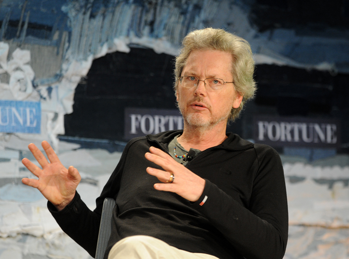

# Linux 牛人

## Linux 之父

* 林纳斯·托瓦兹（Linus Torvalds）

    

Linus Torvalds被称作Linux之父，著名的电脑程序员、黑客。Linux内核的发明人及该计划的合作者。他利用个人时间及器材创造出了这套当今全球最流行的操作系统内核之一，现受聘于开放源代码开发实验室（OSDL：Open Source Development Labs, Inc），全力开发Linux内核。

Linux是一个诞生于网络、成长于网络且成熟于网络的奇特的操作系统。1991年，当时还是芬兰大学生的Linus Torvalds萌发了开发一个自由的Unix操作系统的想法，当年，Linux就诞生了，为了不让这个羽毛未丰的操作系统矢折，Linus Torvalds将自已的作品Linux通过Internet发布。从此一大批知名的、不知名的电脑黑客、编程人员加入到开发过程中来，一场声势浩大的运动应运而生，Linux逐渐成长起来。

Linux一开始是要求所有的源码必须公开，并且任何人均不得从Linux交易中获利。然而这种纯粹的自由软件的理想对于Linux的普及和发展是不利的，于是Linux开始转向GPL，成为GNU阵营中的主要一员。

Linux凭借优秀的设计、不凡的性能，加上IBM、Intel、CA、CORE、Oracle等国际知名企业的大力支持，市场份额逐步扩大，逐渐成为主流操作系统之一。

## C 语言之父和 UNIX 之父

* Ken Thompson

    

Ken Thompson，C语言前身B语言的作者，Unix的发明人之一(另一个是Dennis M. Riche，被尊为DMR)，Belle(一个厉害的国际象棋程序)的作者之一，操作系统Plan 9的主要作者(另一个是Rob Pike, 前不久被google挖走了)。Ken爷爷也算是计算机历史上开天辟地的人物了。1969年还是计算机史前时代，普通人都认为只有大型机才能运行通用的操作系统，小型机只有高山仰止的份儿。至于用高级语言来写操作系统，更是笑谈。Ken爷爷自然不是池中物，于是他和DMR怒了，在1969年到1970间用汇编在PDP-7上写出了UNIX的第一个版本。他们并不知道，一场轰轰烈烈的UNIX传奇由此拉开了序幕。

Ken爷爷在1971年又把Unix用C重写，于是C在随后20年成就了不知多少豪杰的梦想和光荣。Ken爷爷还有段佳话：装了UNIX的PDP-11最早被安装在Bell Lab里供大家日常使用。很快大家就发现Ken爷爷总能进入他们的帐户，获得最高权限。Bell Lab里的科学家都心比天高，当然被搞得郁闷无比。于是有高手怒了，跳出来分析了UNIX代码，找到后门，修改代码，然后重新编译了整个UNIX。就在大家都以为“这个世界清净了”的时候，他们发现Ken爷爷还是轻而易举地拿到他们的帐户权限，百思不解后，只好继续郁闷。谁知道这一郁闷，就郁闷了14年，直到Ken爷爷获得图灵奖之后，发表自己获奖感言时道出个其中缘由。原来，代码里的确有后门，但后门不在Unix代码里，而在编译Unix代码的C编译器里。

## C 语言之父和 UNIX 之父

* Dennis Ritchie

    

丹尼斯·里奇，C语言之父，UNIX之父。曾担任朗讯科技公司贝尔实验室下属的计算机科学研究中心系统软件研究部的主任一职。1978年与布莱恩·科尔尼干（Brian W. Kernighan）一起出版了名著《C程序设计语言（The C Programming Language）》，现在此书已翻译成多种语言，成为C语言方面最权威的教材之一。

丹尼斯·里奇被世人尊称为“无形之王的C语言之父”，是计算机及网络技术的奠定者，曾担任朗讯科技公司贝尔实验室下属的计算机科学研究中心系统软件研究部的主任一职。是为乔布斯等一众IT巨擘提供肩膀的巨人。

## 著名黑客，GNU 创始人，开发了 Emacs、gcc、bash shell

* Stallman

    

理查德·马修·斯托曼（Richard Matthew Stallman, RMS，生于1953年）。

自由软件运动的精神领袖、GNU计划以及自由软件基金会（Free Software Foundation）的创立者、著名黑客。

他的主要成就包括Emacs及后来的GNU Emacs，GNU C 编译器及GNU 调试器。 他所写作的GNU通用公共许可证（GNU GPL）是世上最广为采用的自由软件许可证，为copyleft观念开拓出一条崭新的道路。

## BSD 开发者

* Bill Joy

    

威廉·纳尔逊·乔伊（William Nelson Joy，1954年11月8日－），通称比尔·乔伊（Bill Joy），美国著名计算机科学家[1]  ，创立了BSD和Vi编译器 。

1982年，与Vinod Khosla、Scott McNealy和Andy Bechtolsheim一起创立了太阳微系统公司（Sun Microsystems）[1]  ，并作为首席科学家直到2003年。后来经营自己的风险投资公司HighBAR Ventures，也是知名投资公司Kleiner Perkins的合伙人。

## Minix 开发者

* Tanenbaum

著名的技术作家、教育家和研究者，IEEE高级会员、ACM高级会员、荷兰皇家艺术和科学院院士、1994年ACM Karl V. Karlstrom杰出教育奖、1997年ACM计算机科学教育杰出贡献奖、2002年Texty卓越教材奖、第10届ACM操作系统原理研讨会杰出论文奖、被列入“Who's Who in the World”人物目录。