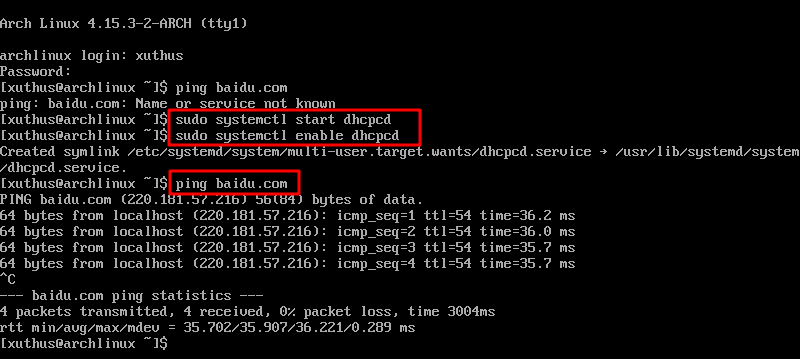
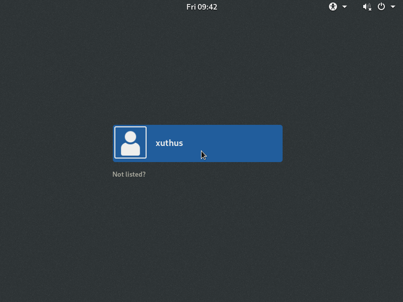

# 安装后的配置

> **环境**： win10+VMware14+16G虚拟磁盘空间+archlinux-2018.02.01-x86_64版本镜像文件

## 网络配置

> 刚安装完毕系统，会发现网络没连接 需要手动启动网络连接


```bash
#启动dhcpcd有线连接
sudo systemctl start dhcpcd
#开机自动启动dhcp服务
sudo systemctl enable dhcpcd
```



> 无线连接 --内容待添加

## 安装桌面

### 安装gnome桌面

> gnome桌面简单易用 易于配置

```bash
#安装xorg框架
sudo pacman -S xorg xterm xorg-xinit xorg-server xorg-server-devel

#安装显卡驱动 根据自己的情况选择安装
sudo pacman -S xf86-video-ati     AMD显卡
sudo pacman -S xf86-video-nouveau     NVIDIA显卡
sudo pacman -S xf86-video-vesa     通用显卡
sudo pacman -S xf86-video-vmware     vmware虚拟机的显卡

#安装字体
sudo pacman -S ttf-dejavu wqy-microhei  
#安装gnome桌面
sudo pacman -S gnome gnome-extra

#安装完成后，在用户家目录新建.xinitrc文件，并且添加如下内容
exec gnome-session

#安装触摸板驱动
sudo pacman -S xf86-input-synaptics
#安装启动器
sudo pacman -S gdm
#开机启动gnome桌面
sudo systemctl enable gdm
#重启即可进入gnome桌面
reboot
```



### 安装kde桌面

> kde桌面视觉效果良好 制定程度高 插件扩展丰富

```bash
sudo pacman -S kf5 kf5-aids  
sudo pacman -S plasma kdebase kdegraphics-ksnapshot gwenview  
sudo pacman -R plasma-mediacenter  
sudo pacman -S sddm sddm-kcm  
sudo systemctl enable sddm  

#在sddm.conf文件进行编辑
sudo vim /etc/sddm.conf  
#添加内容
[Theme]
Current=breeze
CursorTheme=breeze_cursors  

#安装kde中文语言包
sudo pacman -S kde-l10n-zh_cn
#(选装)安装kde全部应用
sudo pacman -S kde-applications
```

## 安装常用软件

> 一下软件在日常经常用到

```bash
#解压缩软件
pacman -S p7zip zip unzip rar unrar
#NTP时间同步
pacman -S ntp  
systemctl enable ntpd  
#NTFS系统识别
pacman -S ntfs-3g  
#
```

## 本文有借鉴

1. [cnblogs](https://www.cnblogs.com/vachester/p/5635819.html)
1. [CSDN](http://blog.csdn.net/u010968957/article/details/52012291)