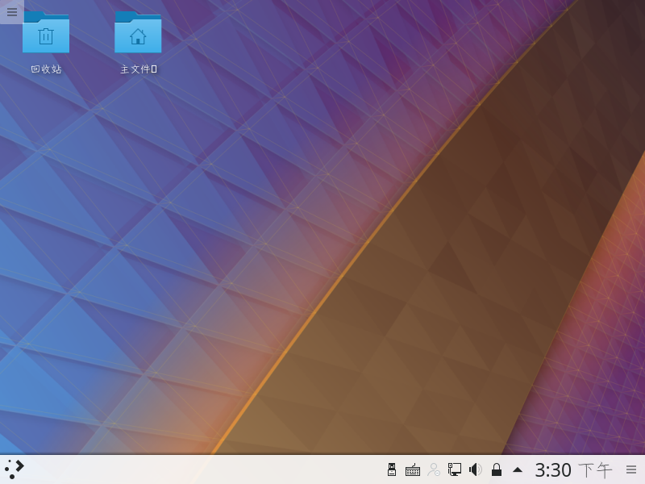

# 安装后的配置

> **环境**： win10+VMware14+16G虚拟磁盘空间+archlinux-2018.02.01-x86_64版本镜像文件

## 网络配置

> 刚安装完毕系统，会发现网络没连接 需要手动启动网络连接


```bash
#启动dhcpcd有线连接
sudo systemctl start dhcpcd
#开机自动启动dhcp服务
sudo systemctl enable dhcpcd
```


> 无线连接 --内容待添加

## 安装桌面

### 安装gnome桌面

> gnome桌面简单易用 易于配置

```bash
#安装xorg框架
sudo pacman -S xorg xterm xorg-xinit xorg-server xorg-server-devel

#安装显卡驱动 根据自己的情况选择安装
sudo pacman -S xf86-video-ati     AMD显卡
sudo pacman -S xf86-video-nouveau     NVIDIA显卡
sudo pacman -S xf86-video-vesa     通用显卡
sudo pacman -S xf86-video-vmware     vmware虚拟机的显卡

#安装字体
sudo pacman -S ttf-dejavu wqy-microhei  
#安装gnome桌面
sudo pacman -S gnome gnome-extra

#安装完成后，在用户家目录新建.xinitrc文件，并且添加如下内容
exec gnome-session

#安装触摸板驱动
sudo pacman -S xf86-input-synaptics
#安装启动器
sudo pacman -S gdm
#开机启动gnome桌面
sudo systemctl enable gdm
#重启即可进入gnome桌面
reboot
```


### 安装kde桌面

> kde桌面视觉效果良好 制定程度高 插件扩展丰富

```bash
sudo pacman -S kf5 kf5-aids  
sudo pacman -S plasma kdebase kdegraphics gwenview  # KDE Plasma桌面环境 基础包 图像处理相关工具的软件包 KDE图片浏览工具
sudo pacman -S plasma-mediacenter  # 媒体中心
sudo pacman -S sddm sddm-kcm  # 用于X11和wayland视窗系统的显示管理器（图形登录界面）
sudo systemctl enable sddm  # 开机自启动sddm服务
#编辑sddm服务的配置文件
sudo vim /etc/sddm.conf  
#添加内容
[Theme]
Current=breeze
CursorTheme=breeze_cursors  

#安装kde中文语言包
sudo pacman -S kde-l10n-zh_cn
#(选装)安装kde桌面应用
sudo pacman -S kde-applications
sudo pacman -S gtk-engines gtk2 gtk3 # 跨平台的图形工具包
sudo pacman -S gnome-themes-standard gnome-icon-theme # 显示的主题及图标
sudo pacman -S gvfs gamin # GNOME桌面系统的虚拟文件系统+文件和目录监控系统
#解压缩软件
sudo pacman -S p7zip zip unzip rar unrar
#NTP时间同步
sudo pacman -S ntp  
sudo systemctl enable ntpd
#networkmanager网络管理
sudo pacman -S networkmanager
sudo pacman -S net-tools
sudo systemctl enable NetworkManager
#音频安装
sudo pacman -S alsa-utils pulseaudio # 声卡测试和音频编辑的工具 + 通过网络工作的声音服务
sudo pacman -S pulseaudio-alsa
sudo pacman -S libcanberra-pulse
sudo pacman -S libcanberra-gstreamer
sudo pacman -S jack2-dbus
#NTFS系统识别
sudo pacman -S ntfs-3g
#安装fcitx输入法
sudo pacman -S fcitx fcitx-rime
sudo pacman -S fcitx-im
sudo pacman -S kcm-fcitx
vim ~/.xprofile
#加入以下内容
export LANG=zh_CN.UTF-8  
export LC_ALL=zh_CN.UTF-8  
export GTK_IM_MODULE=fcitx
export QT_IM_MODULE=fcitx
export XMODIFIERS="@im=fcitx"
#重启
reboot
```




--《其他内容待添加》

## 本文有借鉴

1. [cnblogs](https://www.cnblogs.com/vachester/p/5635819.html)
1. [CSDN](http://blog.csdn.net/u010968957/article/details/52012291)