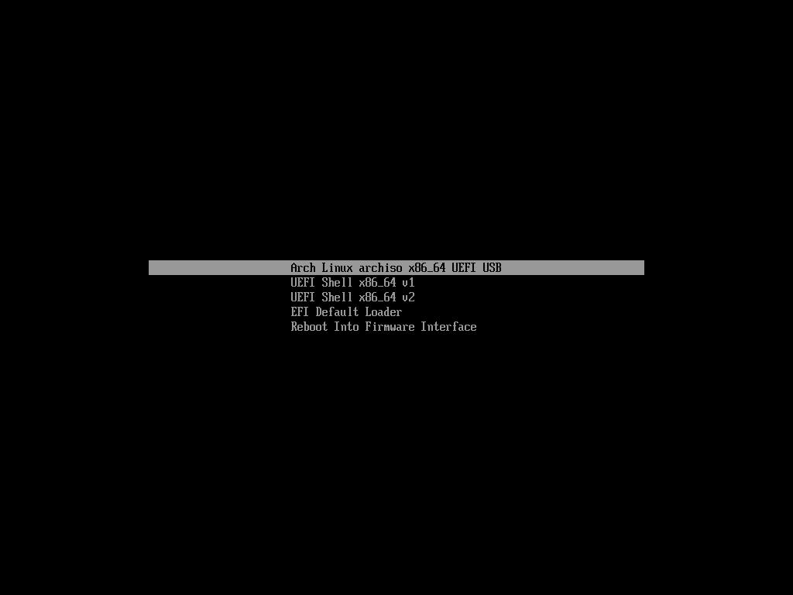

# 安装archlinux

> 依据「Arch 之道」：我们不会为你配置好一切，因为“喜好和需求，每人皆不同”，但是会尽量确保让配置时方便和简单。事实上，甚至远比使用某些Linux中文版本容易。--《ArchWiki》

**安装环境** ：windows10+VirtualBox虚拟机+16G虚拟磁盘空间+archlinux-2018.02.01-x86_64版本镜像文件

**提示：** 建议新手不要玩弄此系统

## 安装开始

> 配置好虚拟机后，点击启动，进入如下界面，选择第一个选项



> 经过短暂的系统加载后，会来到如下界面，这以为着你可以开始操作他了。


> 现在让我们检测系统网络连接是否正常

```bash
ping baidu.com
#如果ping失败，意味着网络连接有问题，你需要检测网络配置
```


> 更新系统时间

```bash
#用 systemd-timesyncd 确保系统时间是正确的
timedatectl set-ntp true
```

> 编辑镜像站文件 由于软件仓库源多数为国外网站，在进行系统安装时，下载网速可能特别慢。先检查一下仓库源文件是否有中国源，没有的话添加，在这里我们使用清华大学源

```bash
#编辑仓库源文件
vi /etc/pacman.d/mirrorlist
#在文件的最顶端添加如下内容(我的这里已经有一个中国国内源了)
Server = https://mirrors.tuna.tsinghua.edu.cn/archlinux/$repo/os/$arch

#更新软件包缓存
pacman -Syy
```


## 进行磁盘分区

```bash
#查看系统的硬盘设备 有两个命令lsblk或者fdisk -l,两个任选其一
lsblk  #简单显示硬盘信息
fdisk -l  #详细显示硬盘信息
```


> 由上面可以发现，/dev/sda 为我们的安装盘，我们为sda硬盘重新建立分区表[假若你对fdisk命令不熟悉，建议先不尝试往下进行,点击 [这里查看fdisk命令](http://blog.csdn.net/virus_1996/article/details/51523584) ]。分区方案为：

```bash
/dev/sda1  200M  /boot/EFi
/dev/sda2  200M  /boot
/dev/sda3  1G    swap
/dev/sda3  14G   /
```

> 用fdisk进行分区,执行fdisk /dev/sda 进入fdisk交互界面

```bash
fdisk /dev/sda
```


> 输入  **g**  新建gpt分区表


> 输入  **n**  添加分区，此分区为/boot/EFI


> 回车(默认分区数)，回车(默认扇出开始2048),输入  **+200M**,设置分区大小为200m


> 新建第二个分区，此分区为/boot,设置输入同上


> 新建第三个分区，此分区为 SWAP 交换分区 ,输入 回车(默认分区数)，回车(默认扇出开始2048),输入  **+1G**,设置分区大小为1G


> 新建第四个分区，此分区为根分区  / ，一路回车 分配所有空闲磁盘到此分区


> 查看分区列表 输入 **p**


> 保存修改后的分区方案 输入 **w**


## 格式化分区

> 执行如下命令 进行分区格式化

```bash
mkfs.fat -F32 /dev/sda1  #此分区为/boot/EFI
mkfs.ext4 /dev/sda2  # /boot分区
mkswap /dev/sda3  # 此为交换分区格式化
swapon /dev/sda3  # 此命令开启交换分区
mkfs.ext4 /dev/sda4  #此分区为根分区
```


## 挂载分区

> 执行如下命令进行挂载

```bash
#执行挂载
mount /dev/sda4 /mnt    #挂载根分区
mkdir /mnt/boot
mount /dev/sda2 /mnt/boot   #挂载/boot分区
mkdir /mnt/boot/EFI
mount /dev/sda1 /mnt/boot/EFI   #挂载/boot/EFI
```

> 挂载完成后 查看磁盘信息


## 安装操作系统

> 现在开始安装基本的操作系统

```bash
pacstrap -i /mnt base base-devel net-tools
```

> **生成fstab** ： fstab文件负责配置Linux开机时自动挂载的分区，某些时候当Linux系统下划分了新的分区后，需要将这些分区设置为开机自动挂载，否则，linux是无法使用新建的分区的。磁盘分区都必须挂载到目录树中的某个具体的目录上才能进行读写操作，而fstab正是负责这一配置

```bash
#fstab中记录了挂载的相关信息，Archlinux中提供了工具来一键生成
genfstab -U -p /mnt >> /mnt/etc/fstab

#查看fstab文件是否正常
cat /mnt/etc/fastab
```


> 切换到新系统

```bash
arch-chroot /mnt /bin/bash
```


> 进行本地语言设置

```bash
vi /etc/locale.gen
#删除en_US.UTF-8 UTF-8 和 zh_CN.UTF-8 UTF-8 前面的#
en_US.UTF-8 UTF-8
zh_CN.UTF-8 UTF-8
```

> 执行locale-gen 立即生效本地语言

```bash
locale-gen
echo LANG=zh_CN.UTF-8 >> /etc/locale.conf
```


> 设置时区

```bash
ln -s /usr/share/zoneinfo/Asia/Shanghai /etc/localtime
```

> 设置硬件时间

```bash
hwclock --systohc --utc
```

> 设置root密码

```bash
passwd
```

> 引导系统 GRUB进行UEFI引导 安装引导工具

```bash
pacman -S dosfstools grub efibootmgr
```


> 安装grub

```bash
grub-install --target=x86_64-efi --efi-directory=/boot/EFI --recheck
```

> 配置grub

```bash
grub-mkconfig -o /boot/grub/grub.cfg
```


> 设置root密码

```bash
passwd
```

> 添加用户

```bash
#务必添加一个 用户 ，否则后面sddm显示管理器登录的时候无法登录，sddm不会列出root用户
useradd -m -g users -s /bin/bash yourname
#密码设置
passwd yourname
#为你刚才创建的用户 添加sudo权限
vi /etc/sudoers
root ALL=(ALL) ALL #下面一行添加
用户名 ALL=(ALL) ALL
```

> 退出chroot 重启电脑

```bash
exit
reboot
```

> 重启 进入网络配置

```bash
#启动dhcpcd有线连接
sudo systemctl start dhcpcd
#开机自动启动dhcp服务
sudo systemctl enable dhcpcd
```

--<待续>