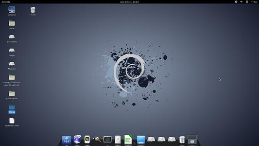
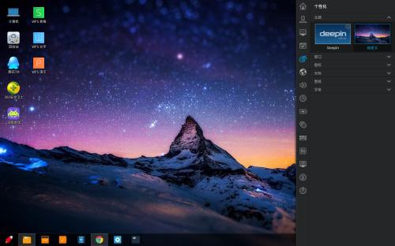
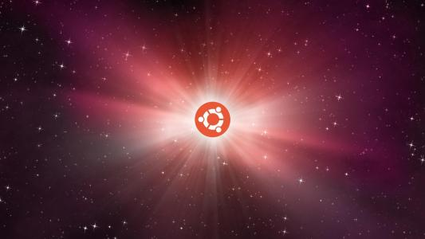

# Debian 系列简介[百度百科](https://baike.baidu.com/item/Debian/748667?fr=aladdin)

广义的Debian是指一个致力于创建自由操作系统的合作组织及其作品，由于Debian项目众多内核分支中以Linux宏内核为主，而且 Debian开发者 所创建的操作系统中绝大部分基础工具来自于GNU工程 ，因此 “Debian” 常指Debian GNU/Linux。

***维护：debian的创始人 Ian Murdock现由一群自愿付出时间和精力的用户来维护并更新的***
***

## 版本记录

Debian的发行及其软件源有五个分支：

- 旧稳定分支（oldstable）
- 稳定分支（stable）
- 测试分支（testing）
- 不稳定分支（unstable）
- 实验分支（experimental）

## Debian优势

- 操作简单：Debian是社区类Linux操作系统的典范，是迄今为止最遵循GNU规范的Linux系统。
- 安装方便：Debian系列的操作系统集成了很多常用的包。

## debian系列发行版本

1. Debian [详细介绍](debian/debian.md)
2. Ubuntu [详细介绍](debian/ubuntu.md)
3. deepin [详细介绍](debian/deepin.md)
4. Linux Mint [详细介绍](debian/linuxMint.md)
5. Elementary OS [详细介绍](debian/elementaryOS.md)
6. kali [详细介绍](debian/kali.md)
7. Tails [详细介绍](debian/tails.md)
8. 麒麟 [详细介绍](debian/kylin.md)
9. Knoppix[详细信息](debian/knoppix.md)
10. MEPIS[详细信息](debian/mepis.md)
11. CrunchBang[详细信息](debian/crunchBangLinux.md)

***

## 对比Debian、deepin、Ubuntu

Debian | deepin | Ubuntu
----|------|----
免费 | 免费  | 免费
dpkg和apt-get包管理 | bar  | bar
超过18733个软件包 | baz  | baz
Debian | deepin | Ubuntu
---------|-----------|---------
|   | 
