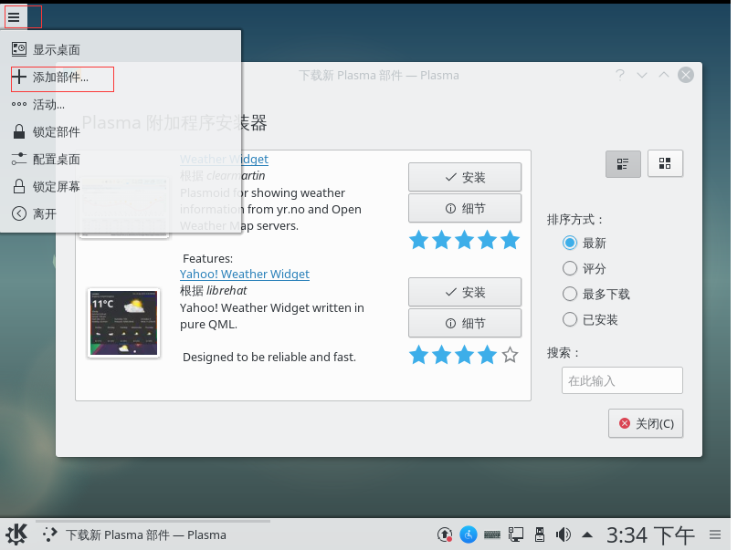
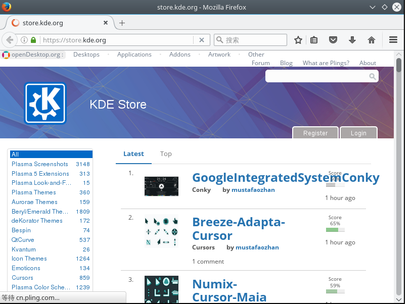

# Debian桌面美化(不能登陆root)

这里介绍 KDE 桌面的配置

1. 点击图示位置可以添加部件来自己美化桌面，如图可以添加相关的部件。

    
    

1. 设置自己喜欢风格的面板。双击部件里的部件就可以添加到面板里。面板的图标大小，间距都可以自己调整。

    
    

1. 打开设置界面可以下载及安装不同风格的桌面，图标也可以改成自己喜欢的样式。

    

1. 在这里可以对你的电脑进行设置，我就介绍一下图标和主题的设置。

    

1. 你可以直接在这选择不同的主题，也可以获取主题，当然也可以在 [KDE商店](https://store.kde.org)里下载好主题，直接安装使用。

    

- 简单配置后的界面，大家可以根据自己的喜好来配置自己的工作界面。

    

## 下面单独介绍一下从 KDE 商店下载图标安装

1. 首先进入KDE商店官网，下载图标。

    

1. 把你下载好的

***相关官方链接***

[KDE官网](https://www.kde.org)||[KDE商店](https://store.kde.org)