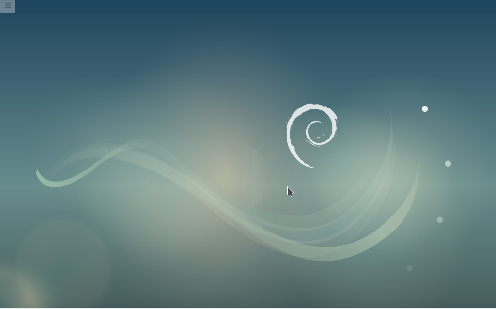

# 安装Debian

1. 下载镜像制作好U盘启动盘。制作过程在[基础](../../../knowledge-base/base/list.md)部分有详细介绍，这里不在赘述
1. 插好U盘开机，电脑将进入引导安装界面
1. 在引导界面选择Graphical install（图形化安装），进入安装过程。

    
以下都是按提示操作如果没有特殊要求基本选择默认选项

1. 选择语言界面，选择中文

    
选择语言提示
    

1. 选择地区

    

1. 配置键盘

    

1. 加载安装组件

    

1. 配置网络（若无要求可跳过，直接继续即可）

    
    

1. 选择归档镜像

    
默认的为清华的源

    
    

1. 设置用户名和密码

    
    

1. 磁盘分区。磁盘分区在[基础](/base.md)部分进行了详细讲解，这里也不再赘述)

    

1. 开始安装系统

    

1. 首次开机

    
**安装好debian都想有一个舒适好看的工作界面**
[debian配置](./config.md)||[桌面美化](./beautify.md)