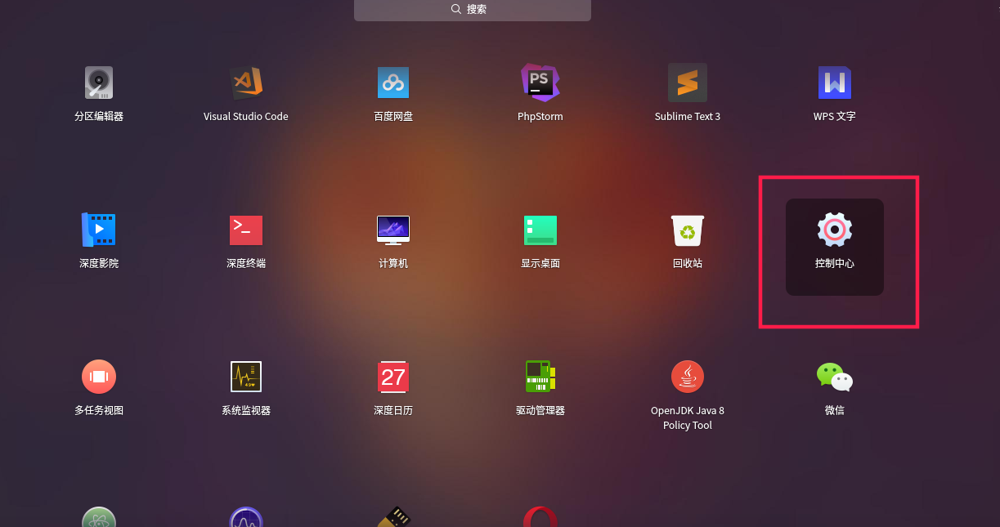

# deeipn的设置（美化）

* Deepin团队基于Qt/C++（用于前端）和Go（用于后端）开发了的全新深度桌面环境（DDE）。
* Deepin适用各个层次的人群,特别是Linux新手操作比较简单。
* Deepin拥有自助设计的，深度软件中心、深度截图、深度音乐等软件。同时也集成了很多常用的软件，非常方便。

    *Deepin 有一个非常好看的桌面环境。这里主要说一下deepin的一些简单的设置*

## 桌面图标以及工作界面的设置

1. 图标的设置:鼠标右键->图标大小...右键任务栏可以更改任务栏的模式(操作简单不赘述)

    

1. 壁纸设置：鼠标右键->设置壁纸...（其他相关设置操作类似不赘述）

    
    

1. 快捷键的设置:控制中心->快捷键->点击你需要更改的快捷键->按下你的键盘(在最下方你也可以选择添加别的快捷键)

    
    
    

## 深度商店安装软件

1. 打开深度商店->找到你需要的软件点击安装即可

    
    

## 添加用户

1. 点击设置中心->账户->创建新用户

    
    

1. 创建用户后就可以用不同的用户登录，进行不同的配置，和操作。

### [root用户登录](./rootconfig.md)

Deepin启动，选择用户时没有root登录 选项但很多人还是想用使用[root用户登录](./rootconfig.md)