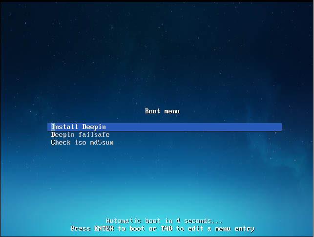
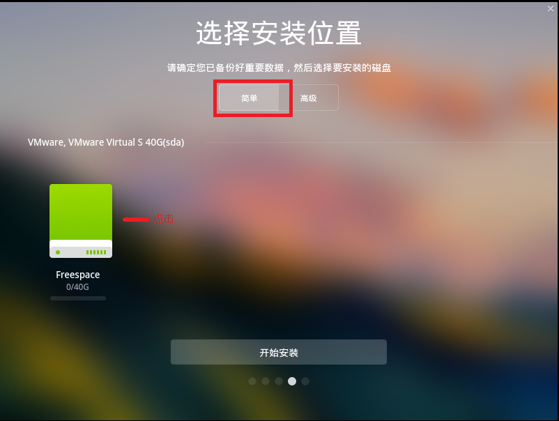
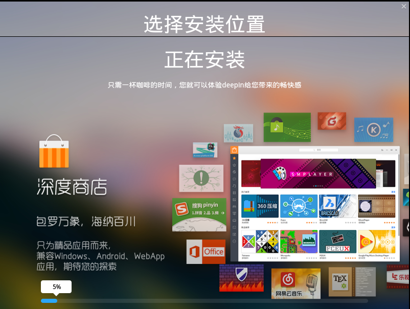
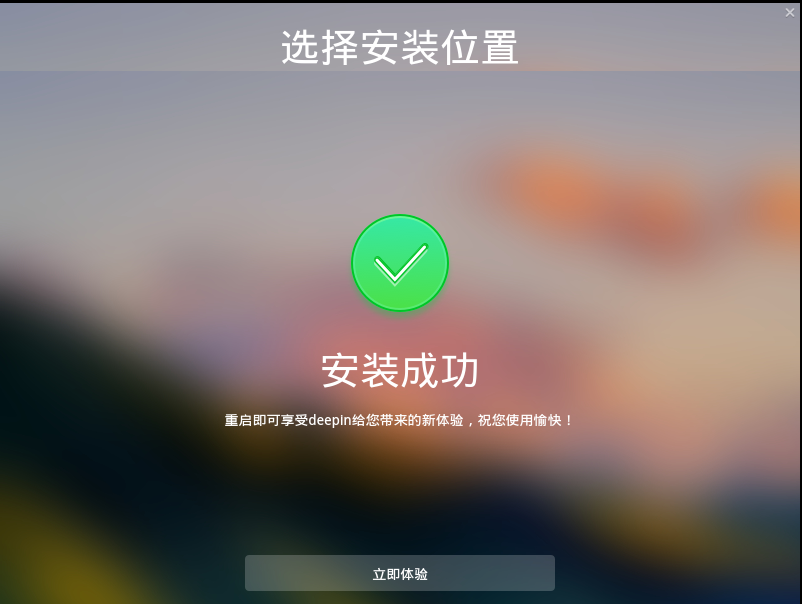

# Deepin安装

1. 下载镜像制作好U盘启动盘。制作过程在[基础](../../../knowledge-base/base/list.md)部分有详细介绍，这里不在赘述
1. 插好U盘开机，电脑将进入引导安装界面，选择安装Deepin

    

1. 语言选择简体中文，然后创建你的用户名，电脑名以及密码

    

1. 选择时区，选择上海就行

    

1. 接下来就是选择安装的位置了，在这是用虚拟机演示的所以就直接选择了“简单”直接安装。如果装真机的话就需要自己按需求来分区，分区在[基础](../../../knowledge-base/list.md)部分有详细的介绍，虽然Linux版本不同，但也是异曲同工。在这里你也可以点击“高级”进行分区。（点击高级：对你空闲的磁盘进行新建分区，一般新建 boot分区、根分区、交换空间、home。根据自己的需求进行分区）

    

1. 开始安装Deepin

    

1. 安装成功后就可以开始使用Deepin了

    