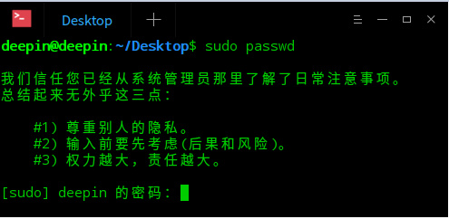
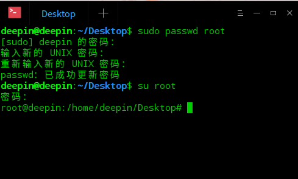

# 这里说一下怎么设置root用户

由于Deepin的root用户在默认情况下是隐藏的，所以你无法在启动的时候使用root登录。

1. 打开终端设置密码:
    * 输入：sudo passwd root
    * 回车,输入当前用户的密码
    * 回车，设置root密码（输入时不会显示任何东西）

    

    

1. 使用root登录：
    * 输入：su root
    * 回车，输入刚设置的root密码
    * 输入 exit 退出root用户

    

    