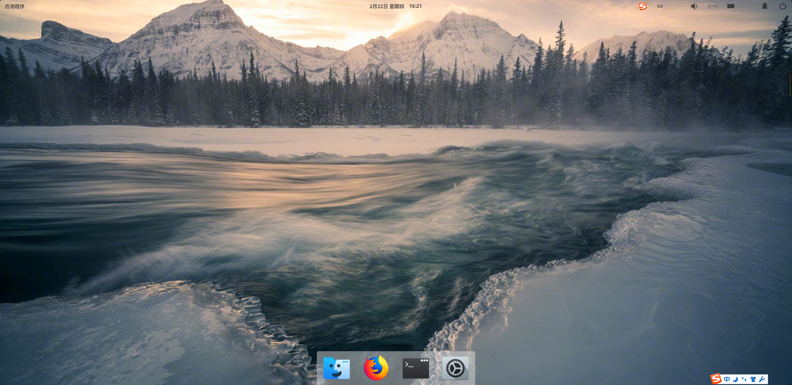
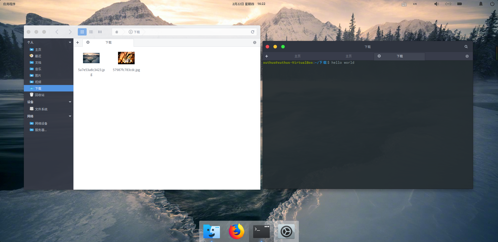
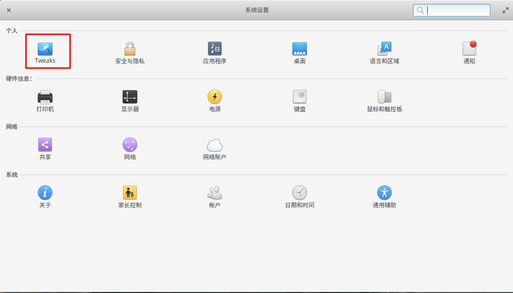
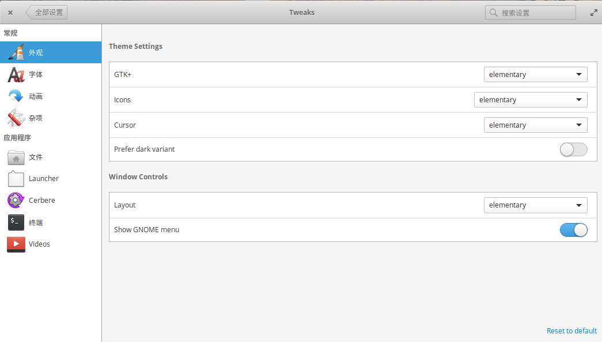
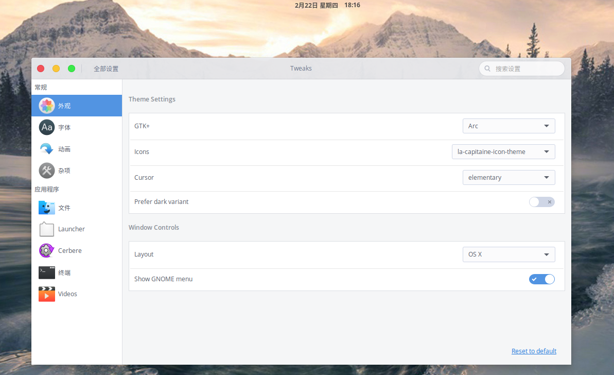
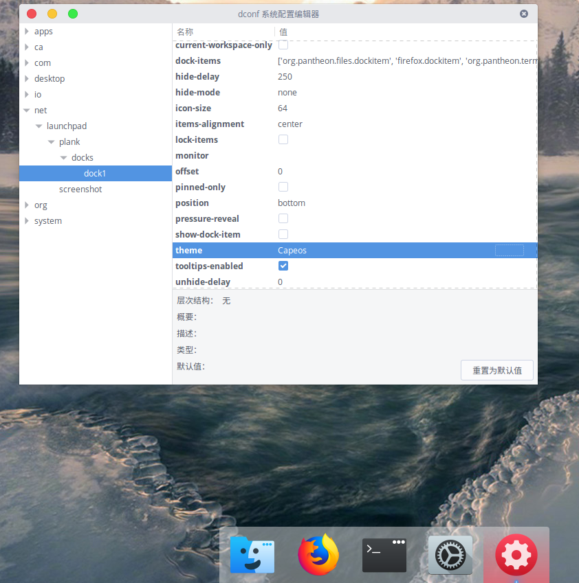

# 美化 Elementary OS

> Elementary OS 系统它是一款基于 Ubuntu 精心打磨美化的桌面 Linux 发行版，号称 “最美的 Linux”。 Elementary 最早是 Ubuntu 的一个美化主题项目，后来太受欢迎演变成了独立的发行版。--《异次元软件》

虽然Elementary OS 系统安装完毕后，桌面环境已经比较耐看了，但是还是有许多的不足之处，现在让我们来弥补一下缺漏，让其向MacOS系统样式更进一步

## 先让我们看看美化后的样式




**美化内容**:  
桌面配置工具：elementary-tweaks  
桌面主题，图标以及dock样式：elementary-2-macos

## 安装相关软件

> elementary-tweaks可以很轻便的配置你的 Elementary OS桌面环境，下面是安装步骤：

安装software-properties-common以支持PPA的添加
```bash
sudo apt-get install software-properties-common
```

添加elementary-tweaks的PPA
```bash
sudo add-apt-repository ppa:philip.scott/elementary-tweaks
sudo apt-get update
sudo apt-get install elementary-tweaks
```

安装完成之后,就可以在**系统设置**中看到它了，其中外观下对的GTK+和Icons选项是我们需要选择的



## 下载主题样式

> elementary-2-macos项目托管在github上，使用需要用到git来克隆仓库

```bash
sudo apt install git
git clone https://github.com/UKeyboard/elementary-2-macos.git
```

克隆完成后 在你的操作目录下会出现elementary-2-macos文件夹,直接执行如下命令，注意，若没有.themes和.icons目录，请在你的家目录新建文件夹

```bash
#若没有.themes和.icons目录，请在家目录新建文件夹
mkdir ~/.themes
mkdir ~/.icons
#将主题文件拷贝到相关的文件夹
cp -r ~/elementary-2-macos/themes/Arc ~/.themes/
cp -r ~/elementary-2-macos/icons/la-capitaine-icon-theme/ ~/.icons/
cp -r ~/elementary-2-macos/plank-theme/* ~/.local/share/plank/
```

拷贝文件成功后，打开**设置**->**tweak**->**外观**，可以发现，GTK+和Icons选项里面，多出了其他的值，点击直接应用它。效果如下：


## 修改dock样式

> 我们已经通过 **cp -r ~/elementary-2-macos/plank-theme/* ~/.local/share/plank/** 命令将下载好的dock主题放到了适当的位置，里面有两个文件夹，分别是 **Pantiva** 和 **Capeos** 我们需要使用dconf-tools工具来修改dock主题

```bash
#安装dconf-tools
sudo apt-get install dconf-tools
```

打开工具dconf-tools，点击选项net->launcpad->docks->dock1 ， 找到theme选项将值替换为~/.local/share/plank/目录下的包名，即 **Pantiva** 或者是 **Capeos**



美化完毕，再去挑一份好看的壁纸吧！[找壁纸](http://win4000.com)

相关项目地址：

1. [elementary-tweaks](https://github.com/elementary-tweaks/elementary-tweaks)
1. [elementary-2-macos](https://github.com/UKeyboard/elementary-2-macos)