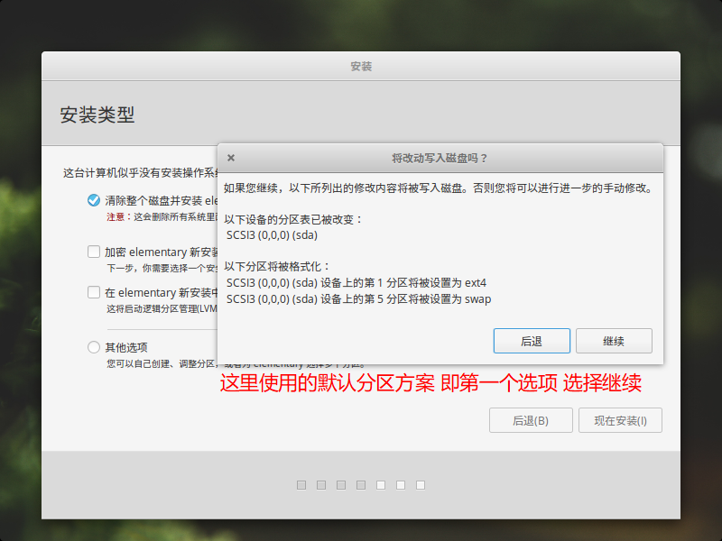

# Elementary OS 安装

> elementary OS 是一个由设计师主导的发行版，在风格上有点类似Mac OS（panel + dock），并且使用了ChromeOS 的应用菜单设计，所以你能在elementary OS Luna 里面看到Mac OS + ChromeOS + Ubuntu + Gnome Shell 的身影。系统的核心依然是 Ubuntu，完全兼容该系统的所有软件包。--《百度百科》

**安装环境** ：windows10+VirtualBox虚拟机+20G虚拟磁盘空间+Elementary OS 0.4.1版本镜像文件

## 安装开始

> 配置好虚拟机，我这里给予4G内存+20G硬盘容量,点击运行虚拟机，直接进入如下界面,选择 中文简体

> 提示勾选更新下载更新，不建议勾选，因为中途下载时间过长，直接默认，点击继续

> 选择分区方案，这里为了简便 选择默认方案，你可以根据自己需求，进行勾选

> 点击 现在安装 弹出窗口 询问是否写入磁盘 选择继续

> 进入选择时区 你可以直接在输入框中输入地区名称或者使用鼠标点选地图

> 键盘布局 默认选项

> 创建用户 该用户作为登录系统的初始用户

> 点击继续 等待安装完毕

> 安装完毕，重启电脑

> 默认的界面状态 安装完毕

