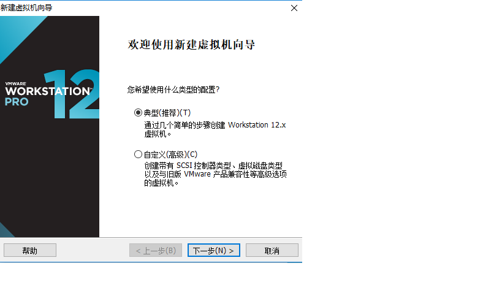
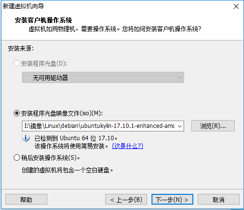
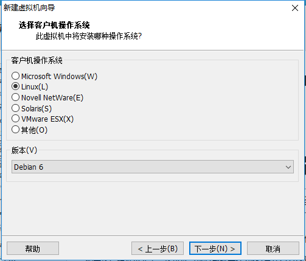
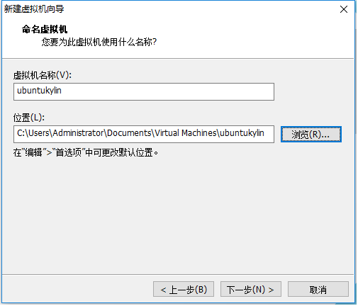
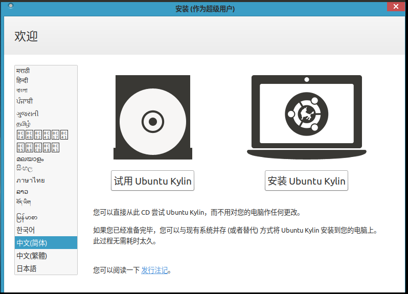
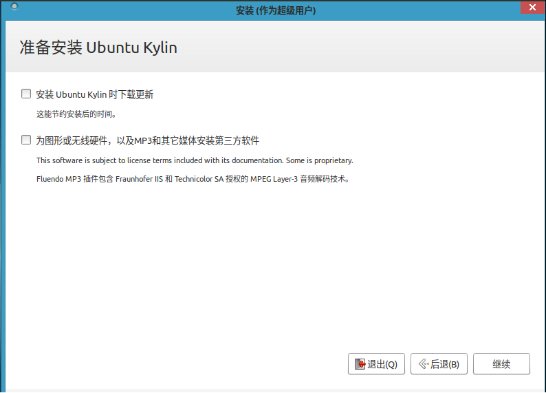
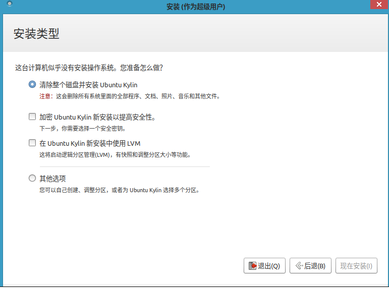

# 安装UbuntuKylin

- 下载镜像制作好U盘启动盘。制作过程在[基础](../../../knowledge-base/base/list.md)部分有详细介绍，这里不在赘述
1. 这里讲一下虚拟机安装过程，我使用的是workstation。（真机安装无法截图所以不好演示）
1. 打开 workstation 新建虚拟机，如果无特殊要求选择典型即可，下一步。

    

1. 在这里选择稍后安装操作系统，下一步。

    

1. 选择版本，选择debian、Ubuntu都可以。

    

1. 选择磁盘位置

    

1. 打开虚拟机选择好语言，点击开始安装。

    

1. 这里视自己的情况而定。

    

1. 选择磁盘安装，这里要注意如果你有多余的空磁盘可以直接选择第一项，进行安装，然后对磁盘进行分区。否则建议选最后一项。[磁盘分区](../../../knowledge-base/base/Disk-knowledge/Disk-Partition-list.md)在基础部分有详细的介绍，这里不再赘述。

    

如果安装过程没有选择语言，默认是英文的，[点这里](./language.md)设置中文

- 看这界面，既有Ubuntu的图标样式，又有window的风格。

**安装好UbuntuKylin都想快速上手，下面的链接看看是否优帮助**

[UbuntuKylin配置](./config.md)||[桌面美化](./beautify.md)