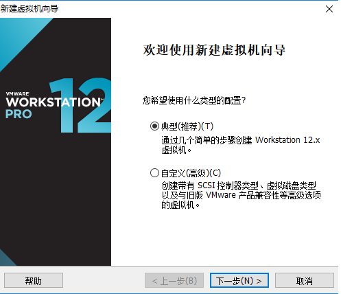
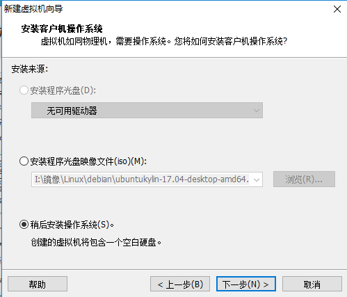
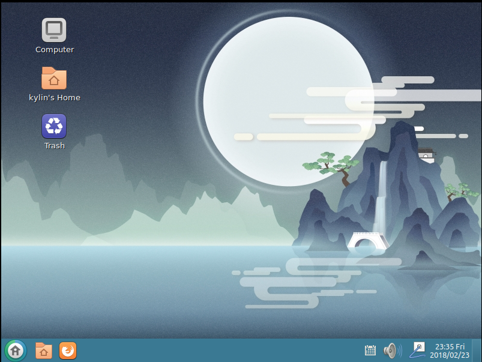

# 安装UbuntuKylin

- 下载镜像制作好U盘启动盘。制作过程在[基础](../../../knowledge-base/base/list.md)部分有详细介绍，这里不在赘述
1. 这里讲一下虚拟机安装过程，我使用的是workstation。（真机安装无法截图所以不好演示）
1. 打开 workstation 新建虚拟机，如果无特殊要求选择典型即可，下一步。

    

1. 选择你下载的镜像，下一步。

    

1. 设置简易的安装信息。

    

1. 选择磁盘位置

    

1. 设置磁盘和内存大小，然后就是等待了。

    

1. 首次开机

    

安装过程没有选择语言，默认是英文的，[点这里](./language.md)设置中文

- 看这界面，既有Ubuntu的图标样式，又有window的风格。

**安装好UbuntuKylin都想快速上手，下面的链接看看是否优帮助**

[UbuntuKylin配置](./config.md)||[桌面美化](./beautify.md)