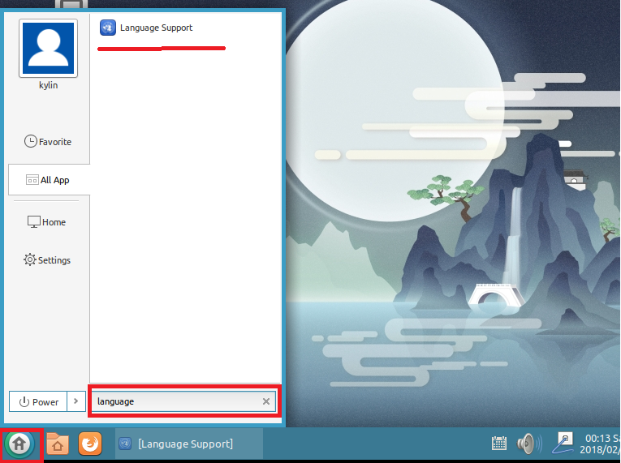
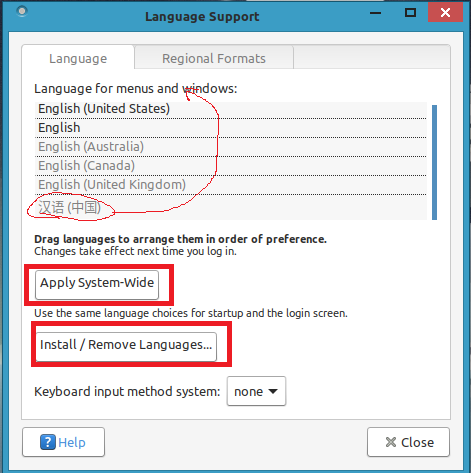

# 语言设置

在安装过程中没有设置语言的话，默认是英语的，下面我们就讲一下如何切换语言。

1. 点击开始，搜索 language support

    

1. 打开软件，如果在语言框里已经有中文，直接把中文拉到第一位，点击应用到整个系统。

    如果在已有的语言里没有中文，就点击安装语言，找到中文并安装，然后把中文拖到第一位，点击应用到整个系统。

    操作过程中会要你输入密码，输入当前用户密码即可，应用后重启电脑就可以了。

    
    

设置过程跟 Ubuntu 基本一样