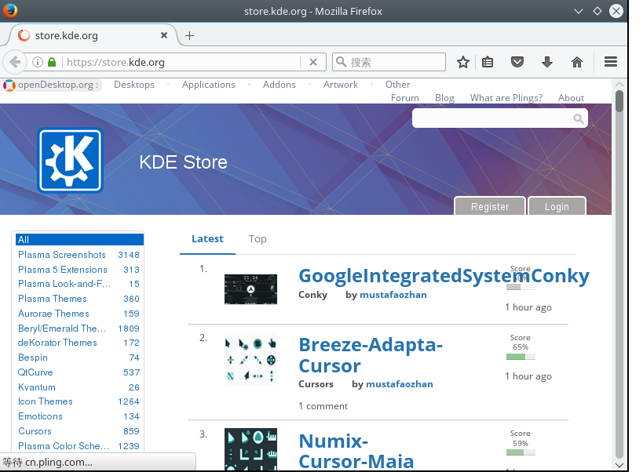

# Ubuntu 美化

Ubuntu 首次安装界面（页面简单实用）

Ubuntu 图标属于朴素风格，个人觉得还可以，当然如果觉得不好可以在 KDE 商店下载相应的图标。这里就先介绍一下 Ubuntu 的简单美化设置。

## 下面单独介绍一下从 KDE 商店下载图标安装

1. 首先进入KDE商店官网，下载图标。

    

1. 把你下载好的

***相关官方链接***

[KDE官网](https://www.kde.org)||[KDE商店](https://store.kde.org)