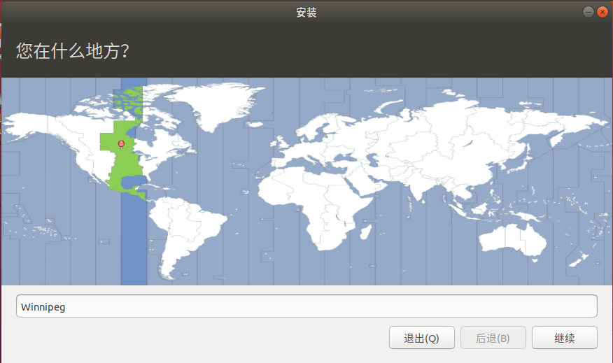

# 安装Ubuntu

1. 下载镜像制作好U盘启动盘。制作过程在[基础](../../../knowledge-base/base/list.md)部分有详细介绍，这里不在赘述
1. 插好U盘开机，电脑将进入引导安装界面，点击左上角的图标开始进行安装。

    

1. 选择语言，本人英语菜建议选简体中文。如果在没有在这里选择好语言，也可以在安装好之后设置语言。具体操作在[配置](./config.md)部分有介绍，这里就不再赘述。

    

1. 插件勾选

    

1. 选择地区

    

1. 设置用户名，密码

    

1. 开始安装(等待就行)

    

1. 安装完成，首次开机

    