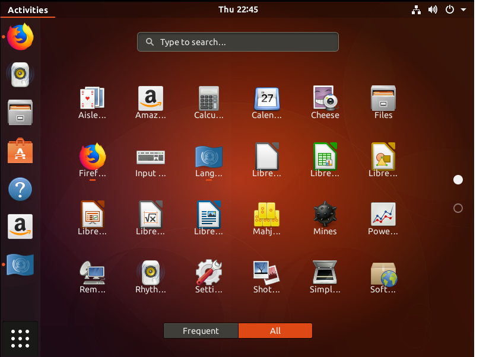
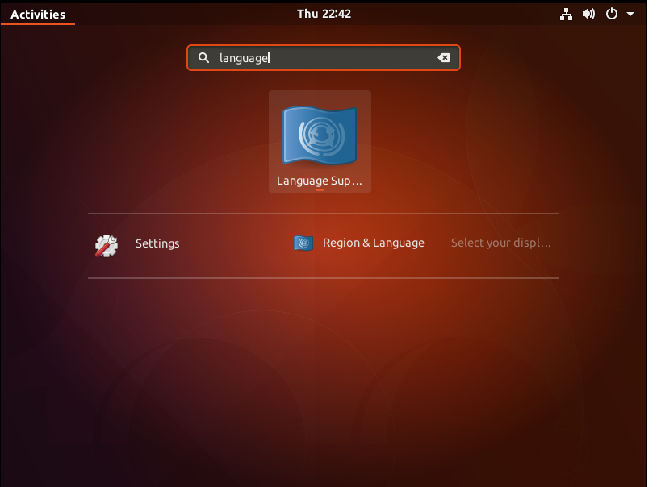
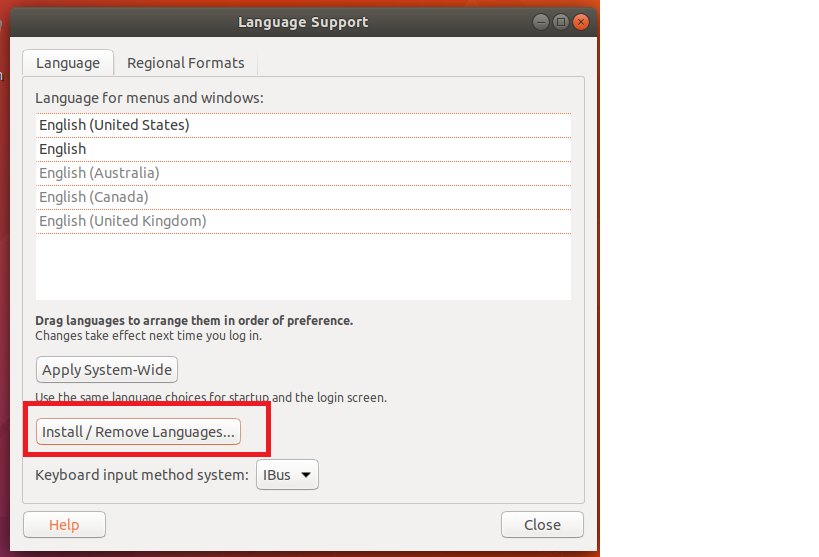
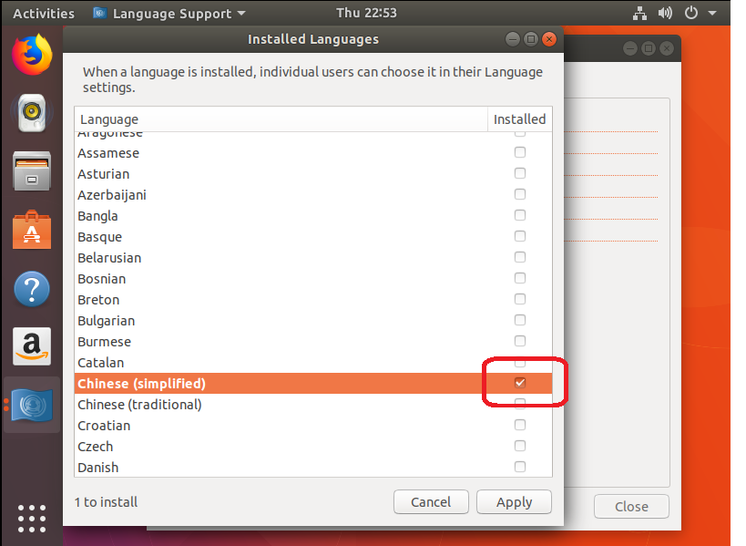
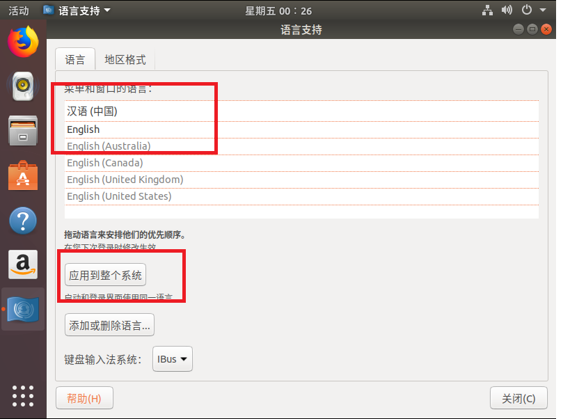

# 语言设置

有些 Ubuntu 的版本并没有安装所有的语言，所以安装好 Ubuntu 还需要自己安装一下。

- 打开软件-->搜索 language -->找到 language Support-->点击图示图标

    
    

- 点开后你会发现可选的语言不多，然后你就可以安装你自己需要的语言。

    
    

- 安装好后将你需要的语言拖到第一位，重启即可。（过程中要输入的密码就是你Ubuntu的登录密码）

    
