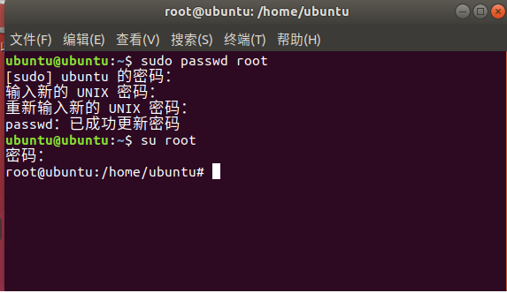

# 设置 root 用户

debian系列（如Ubuntu、deepin、debian）安装过程都不用设置 root 用户，默认是没有 root 登陆的，需要使用 su root 命令来进入 root 用户。首次使用我们需要先设置 root 密码，才能 root登陆。

- 首先 鼠标右键 打开终端，设置密码。
 ```bash
    sudo passwd root
```
输入当前用户的密码,并设置 root 用户密码
 ```bash
    su root
```
使用刚设置的 roo 密码登陆


 ```bash
    exit
```
使用 exit 命令退出root用户。

