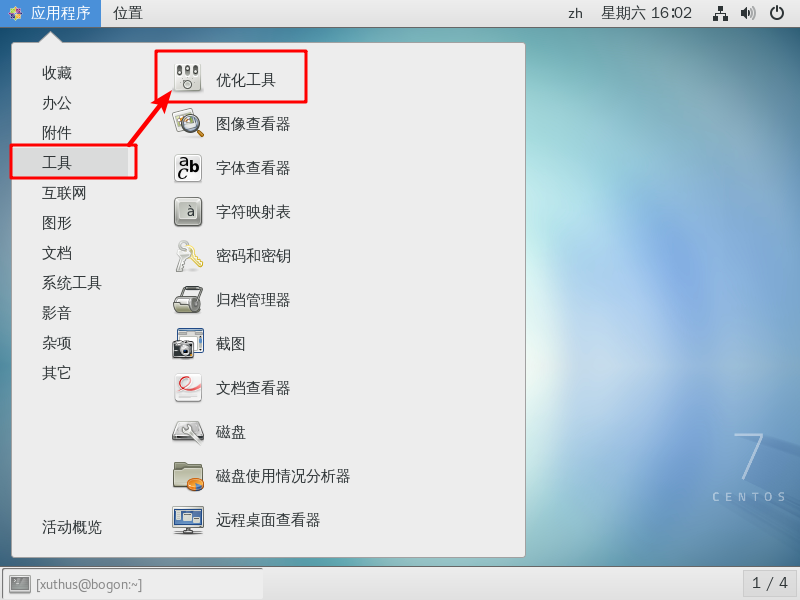
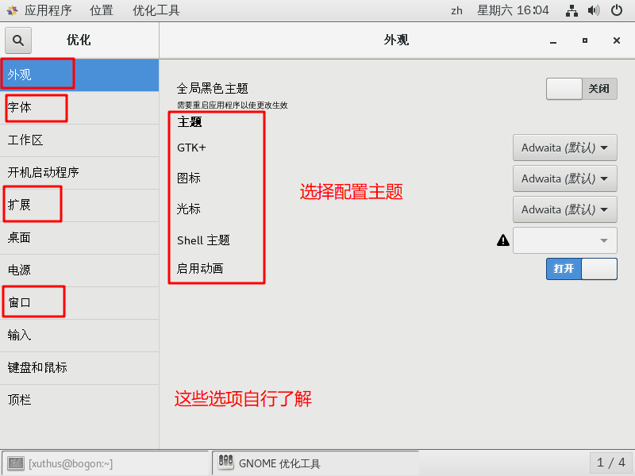
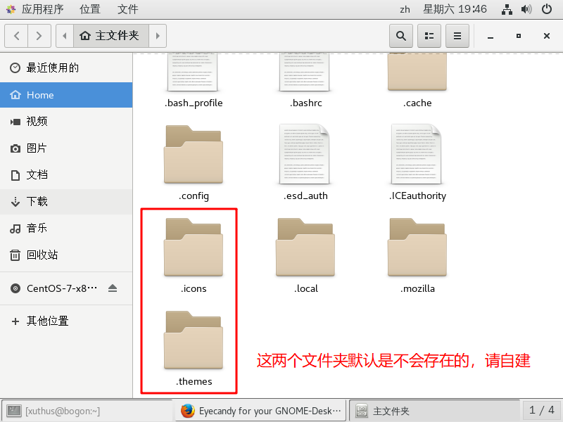
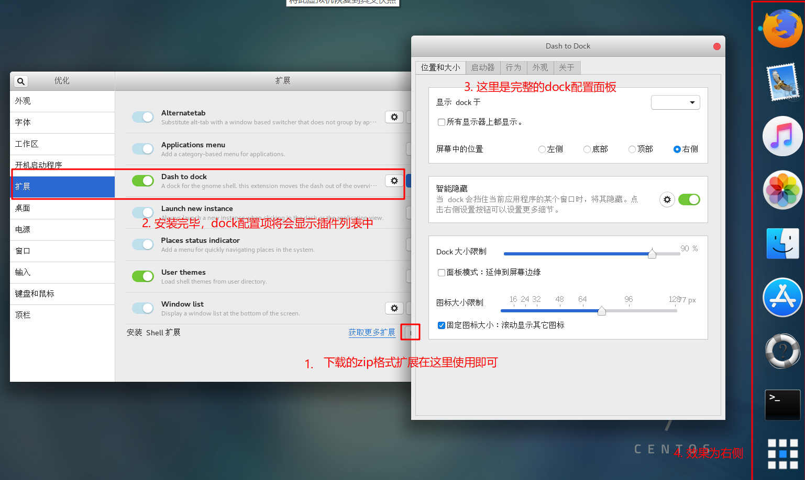
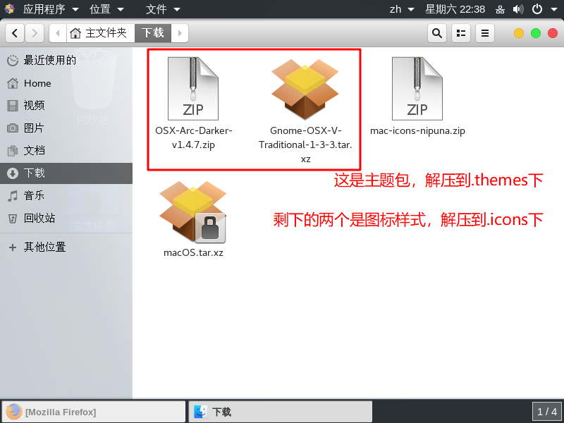
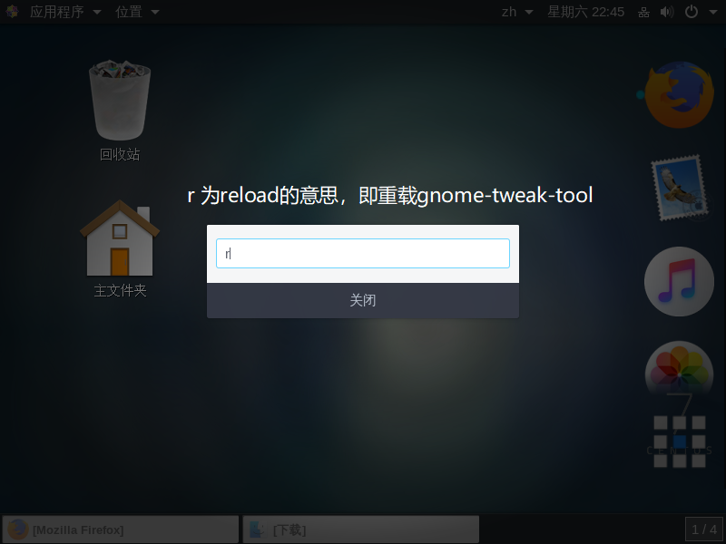
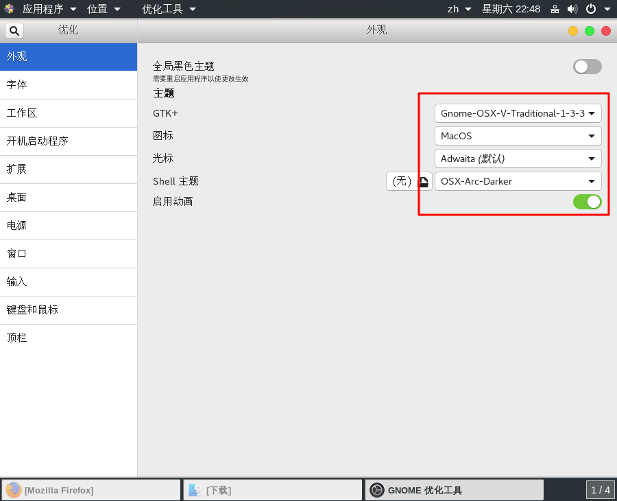
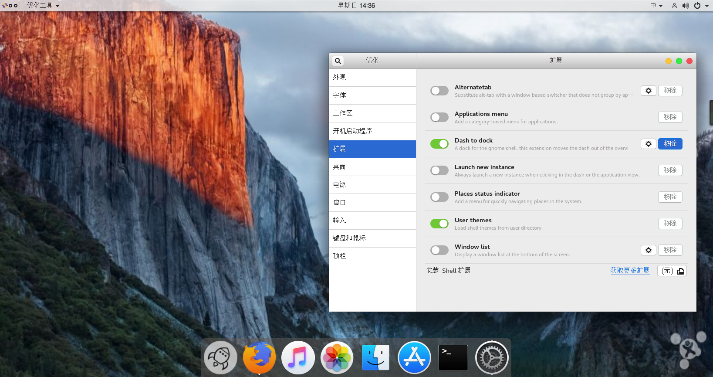

# 美化 CentOS

> 相信很多朋友都希望作死一回(摆脱windows，尝试linux的桌面版)，但是默认的GNOME桌面，丑陋感是明显的，美化一下桌面，是有必要的。

**准备工作：** GNOME桌面(不同的GNOME版本显示效果有些许不同)

**插件网站：**[https://extensions.gnome.org/](https://extensions.gnome.org/)

**主题网站：**[https://www.gnome-look.org/](https://www.gnome-look.org/)

接下来开始我们的易容术吧！首先安装我们的**gnome-tweak-tool**插件，此工具是我们配置美化GNOME桌面的利器。安装完毕后，通过它，我们能够很快的管理我们桌面环境的主题，字体，图标和DOCK等等

```bash
sudo yum install gnome-tweak-tool
```

安装完毕后，通过菜单栏，找到优化工具在**扩展**栏目开启**User themes**扩展，否则我们自己配置主题将不被允许


现在让我们前往[https://www.gnome-look.org/](https://www.gnome-look.org/)下载一下GNOME桌面的主题吧！主题主要由**图标(icons)**，**光标**，**shell主题**构成，顾名思义，图标主要控制应用程序的图标显示，光标控制鼠标样式，shell主题控制桌面顶部样式和输入法颜色等一些其他的样式。

**注意：** 请确保你的家目录下已经存在 ".icons" 和 ".themes" 目录。下载完压缩包后，解压缩需要对号入座，否则gnome-tweak-tool将不会检测到这些数据信息。


## 将GNOME桌面配置成Mac风格

亮眼的Mac OS系统主题是漂亮的，我们来自己手动配置一下吧！在[https://extensions.gnome.org/](https://extensions.gnome.org/)上，搜索**dash-to-dock**,此扩展可以让我们的桌面获得一个dock，并且可以自由设置显示和隐藏规则。

安装完毕后，我们开始安装我们的主题和图标吧！我下载了两份主题样式，分别是：OSX-Arc,Gnome-OSX 还有图标样式：mac-icons，macOS。

**注意:** 解压路径应当是 /home/yourname/.icons 或者 /home/yourname/.themes 下。即为你的家目录下。

好啦，我们将文件解压后，重载一下我们的gnome-tweak-tool工具， 按下ALT+F2键，出现一个输入框，输入 r 即可重载。
然后打开我们的gnome-tweak-tool工具，可以明显的看见我们的主题栏目多了许多的选项，选择你的主题和图标.


有许多的细节需要你自己去修复，附上我的最终美化版本桌面。

整个美化过程算是完毕！