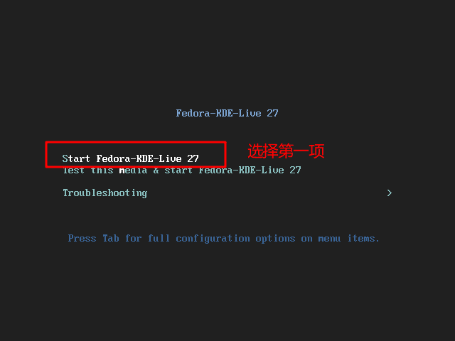
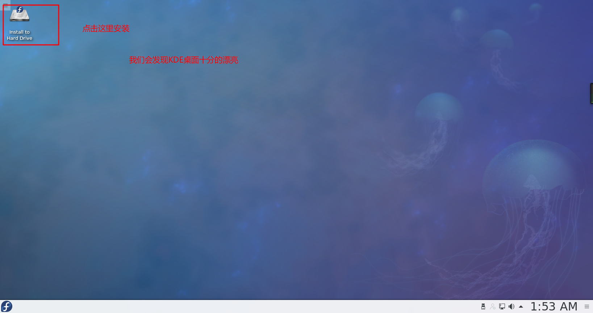
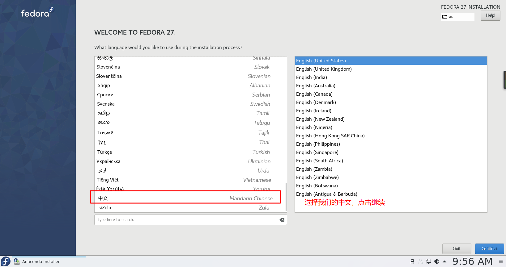
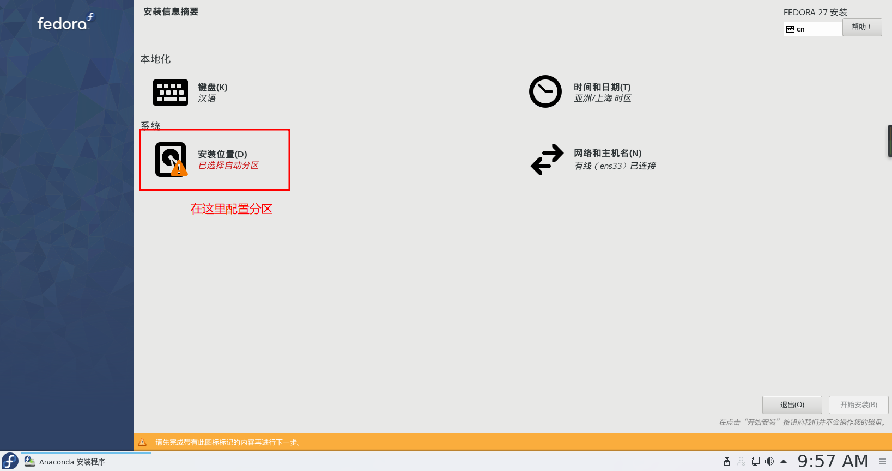
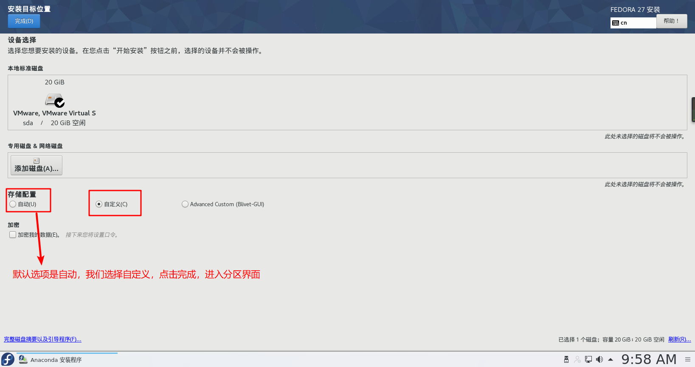
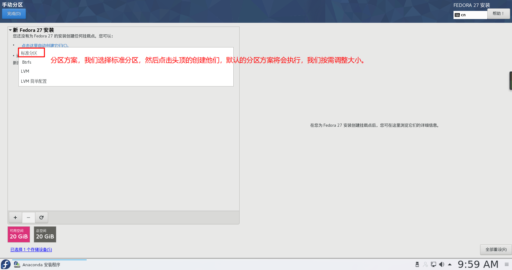
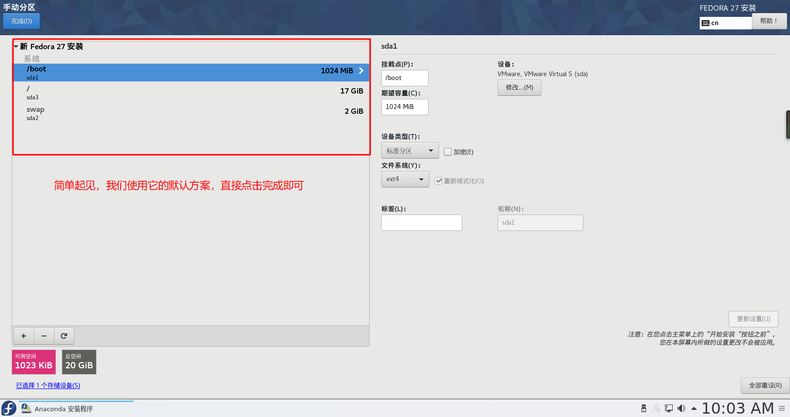
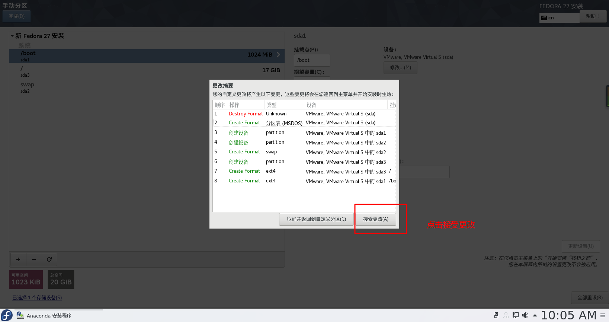
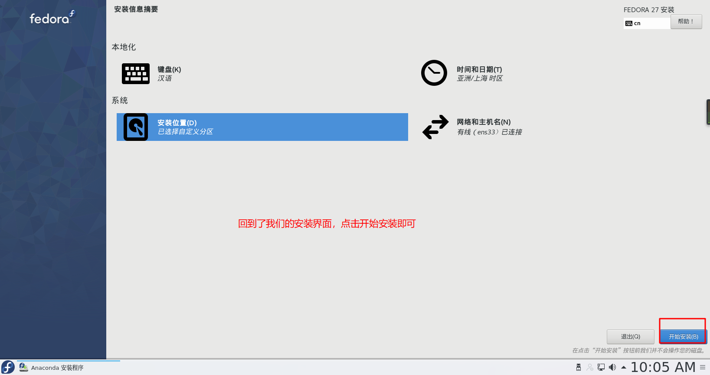

# 安装Fedora 27

> 安装Fedora的过程和安装 RHEL/CentOS 具有通性，这里简单的给大家演示一遍如何安装我们的 Fedora KDE桌面。

**搭建环境：** windows10+VMware虚拟机+20G虚拟磁盘空间+Fedora-KDE-27版本镜像文件

## 开始安装

虚拟机方面的配置我就不再讲述，直接进入正题，开机，选择我们的第一项，启动系统。

点击桌面的安装引导程序，进入安装界面

选择我们熟悉的中文语言

进入安装配置界面，点击选择安装位置，进行磁盘分区

系统默认选项会自定进行磁盘分区，我们选择自定义，进行手动分区

点击分区方案，选择分区方案，你可以尝试LVM分区方案，我这里选择标准分区方案。然后点击上面的创建他们

分区的挂载点大小可调，请根据你的磁盘大小，自行修改参数

分区完毕，我们需要点击确定接受更改

最后回到了我们原来的界面，现在你就可以点击安装了

安装过程中会有用户信息的填写，请规范填写

最终！我们的Fedora就安装完毕了！尽情享用吧！