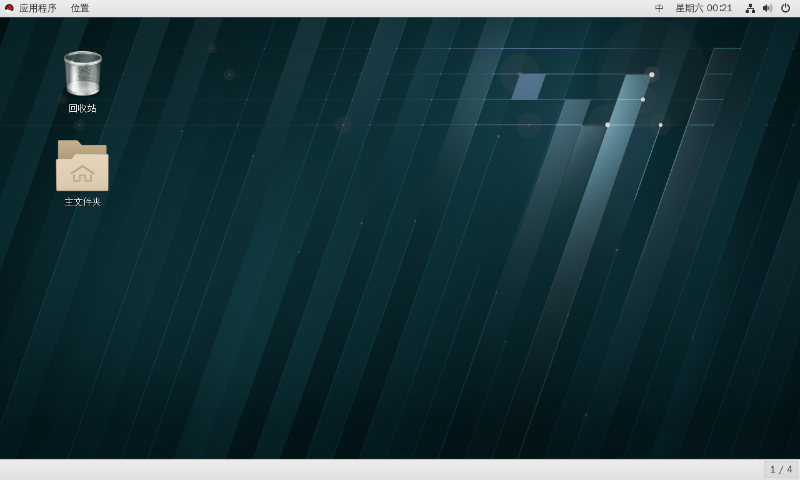

# 在VMware下安装RHEL7.4

> 尝试安装一个Linux发行版本总是令人向往，在这里，给大家演示一遍使用VMware安装。

**搭建环境：** windows10+VMware虚拟机+20G虚拟磁盘空间+RHEL7.4镜像文件

## 开始安装

相信你的准备工作都已经准备充分了，现在来进行我们的安装操作吧。虚拟机的配置我在这里就不进行演示了！相信大家都已经了解了。在这里我已经准备好了一个虚拟机，图片给大家对比一下。

点击**开启此虚拟机**开始我们的安装进程，VMware将会为我们自动加载镜像，进入如下界面，通过键盘，选择**第一项**，回车

进入了选择语言界面，找到我们的中文和中文简体，选择下一步

安装源这里不需要动，当然，你可以使用其他的源，我们在这里不做探讨

点击**软件选择**，这里的选择是至关重要的，你的选择直接影响他的功能，我们在这里演示安装一个桌面环境，所以选择**带GUI的服务器**选项，右侧边栏我们选择KDE，需要注意的是，**带GUI的服务器**默认已经选择好了GNOME桌面，RHEL附带有什么功能，全在你的选择之中

选择完软件，接下来就是选择安装位置了，我们直接选择整个虚拟磁盘，点击完成就OK了。在这里没有分区配置，而是选择的自动配置分区，如果想自己分区但是自己对分区不是很了解，你可以查看我们的**基础**部分的教程。

一切都准备就绪，点击**开始安装**

受到机器性能的影响，安装的过程对你来说可能是漫长的，在此期间，你可以配置一下你的服务器的用户信息。比如创建**普通用户**，配置**root密码**

**root密码**的配置，请尽量服从密码复杂度的原则，并且牢记root密码，谨慎使用root权限

普通用户的配置按照提示完全可以自己完成，但是如果你想要让你的普通用户的帐号拥有管理员权限，勾选**将此用户作为管理员**是可行的

用户信息全都配置完成，软件也安装完毕，现在就选择**重启**吧

看见开机启动界面总是激动人心的，但是想要进入系统，你还需要**接受许可**，由于RHEL是为企业服务的，这里不填写注册

接受许可证后，点击**完成配置**，即可进入登录界面，是不是很激动呢！好的，输入你的帐号信息，登录吧！

欣赏一下桌面吧

